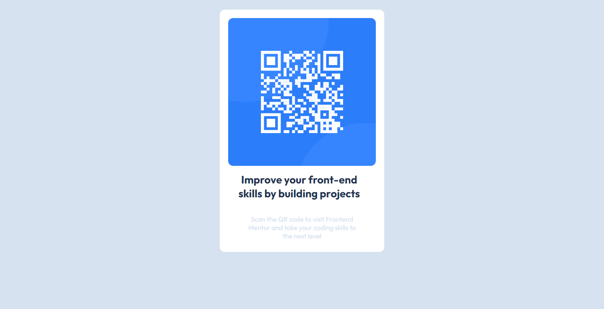

# Frontend Mentor - QR code component solution

This is a solution to the [QR code component challenge on Frontend Mentor](https://www.frontendmentor.io/challenges/qr-code-component-iux_sIO_H). Frontend Mentor challenges help you improve your coding skills by building realistic projects. 

## Table of contents


  - [Links](#links)


### Screenshot




### Links

- Solution URL: [Meu reposirório](https://github.com/CaioQuerino/projeto-card)
- Live Site URL: [Meu site publicado](https://caioquerino.github.io/projeto-card/)

## My process

### Built with

- Semantic HTML5 markup
- CSS custom properties   
- Flexbox
- Responsive CSS
- Mobile-first workflow (Não usei)
    [React](https://reactjs.org/) - JS library
    [Next.js](https://nextjs.org/) - React framework
    [Styled Components](https://styled-components.com/) - For styles


### What I learned

Aprendi a montar um cartão e colcar as informações dentro da mesma usando a tag div para ter o melhor controle dos elementos do cartão e também poder centraliza-los como por exemplo, no centro da página usando o CSS.


´´´HTML
<div class="conteiner">
        <div class="card">
´´´        

```css
    .conteiner{
        display: flex;
        flex-direction: column;
}
```


### Continued development

Pretendo aperfeiçoar a técnica de usar a tag div para centralizar os elementos no meio da página e pretendo me aprofundar mais na hieraquia dos CSS responsivos que no caso seria a relação das tags pai e filho; se no CSS temos um regra pai então todas as outras que são os filhos obedecerão a regra.


### Useful resources

- [Dev em Dobro](https://www.youtube.com/@DevemDobro/) - Os vídeos e os canais do Dev em Dobro me ajuou bastante a entender o conceito de uma tag div em um código HTML e sua relação com a mesma no CSS responsivo.

- [Curso em Vídeo](https://www.youtube.com/@CursoemVideo) - Os cursos do canal Curso em Vídeo foram ótimos para dar o ponta pé inicial na introdução a programação.


## Author

- Website - [Caio Querino](https://github.com/CaioQuerino/)
- Frontend Mentor - [@yourusername](https://www.frontendmentor.io/profile/CaioQuerino)
- Twitter - [@yourusername](https://www.twitter.com/yourusername)


## Acknowledgments

Agradeço aos dois Canais do youtube por fornecerem conteúdo de qualidade para as pesoas que querem iniciar na área de programação.
- https://www.youtube.com/@DevemDobro/
- https://www.youtube.com/@CursoemVideo

